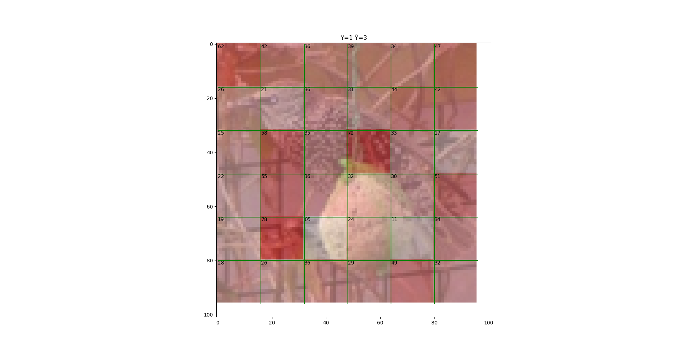
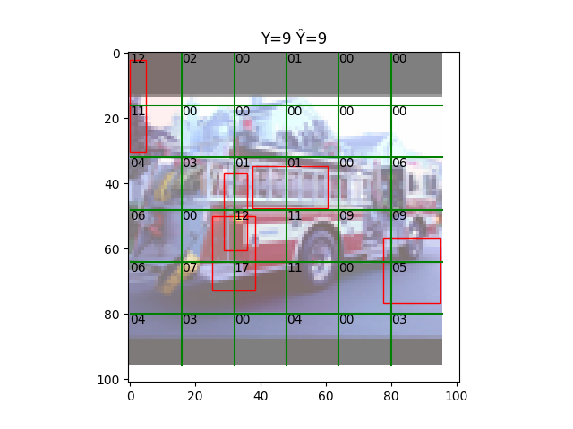
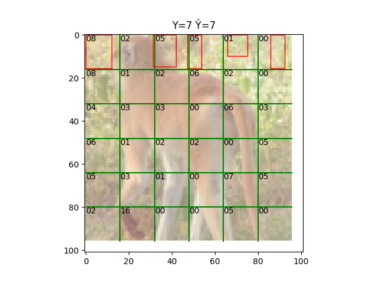
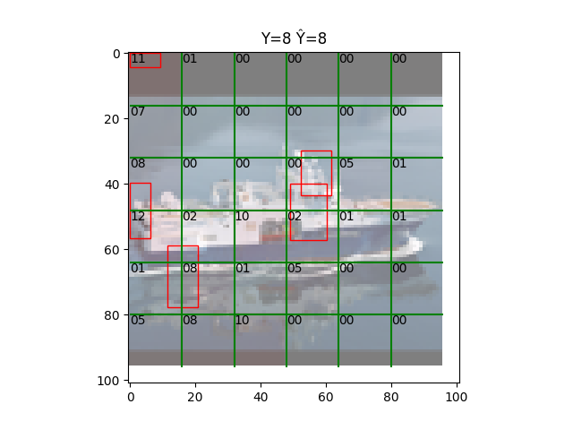

# attention-bboxes
An in-model xAI technique based on predicting intermediate bounding boxes.

Possible approaches:

* Occlusion
```
image ──► encoder ──► bboxes ──► heatmap ──► × ──► classifier
              │                              ▲               
              └──────────────────────────────┘               
```

* Adversarial
```
image ──► encoder ─┐► classifier                                         
                   │                                                     
                   └► bboxes ──► heatmap ──► × ──► encoder ──► classifier
```

Preliminary results using BasicGrid (dataset=STL10):



Preliminary results using GaussianGridGrid using top-5 bounding boxes and confidence=1.5σ (dataset=STL10):







Issues: (1) it errs a lot (but that's not an issue with the model itself); (2) the spatial scores are on the low side; (3) how to measure how good an explanation is?
