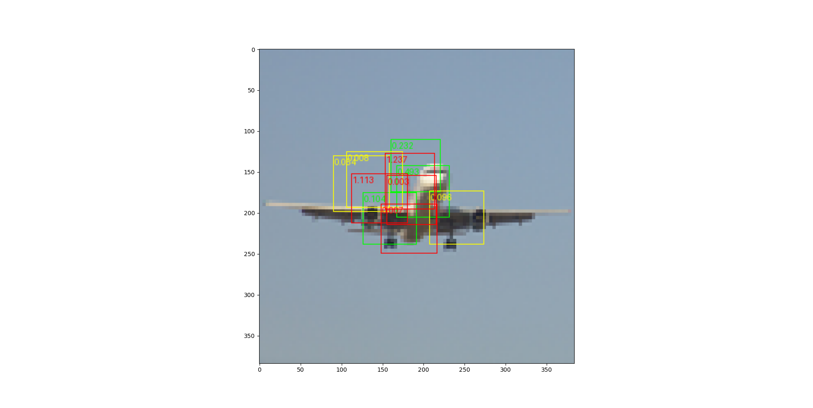
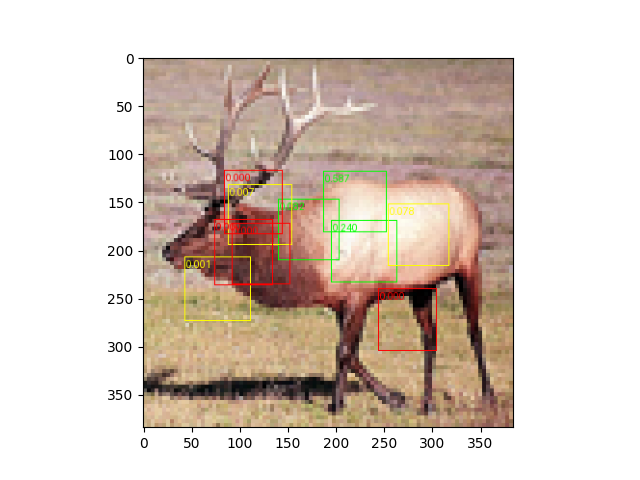
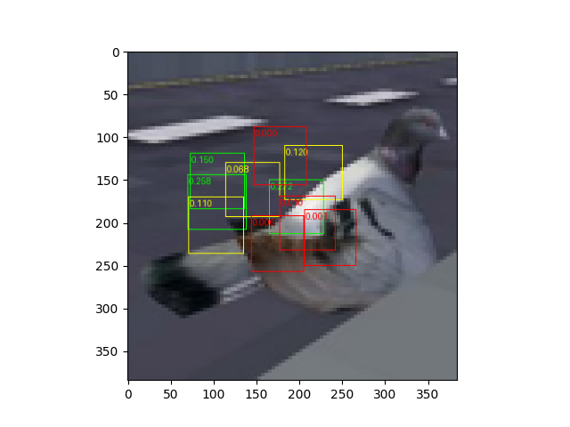
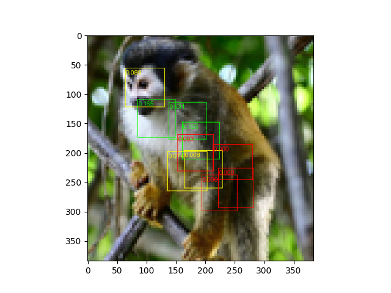

# attention-bboxes
An in-model xAI technique based on predicting intermediate bounding boxes.

Preliminary results using a fully attention based approach (dataset=STL10):

Some missclassified samples

*Classified as Horse*

*Classified as Car*

*Classified as Dog*